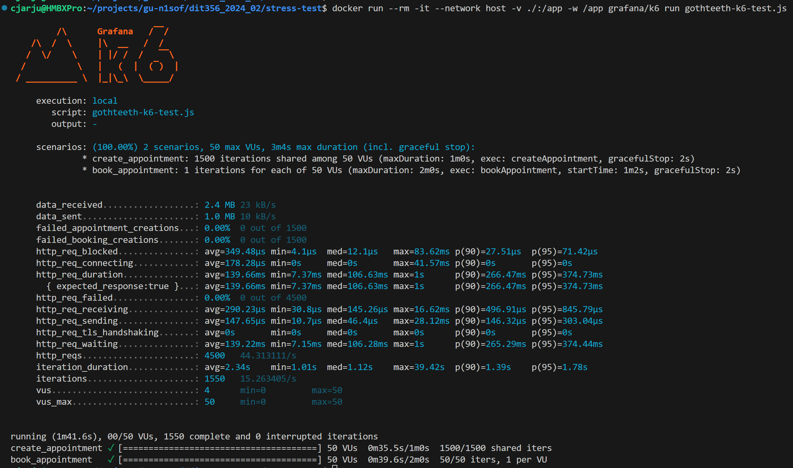

# Stress Test

There are two alternatives to run the load tests, using Grafana k6 or the custom test runner:

## About the Grafana k6 stress test

* There are two scenarios - **appointment creation** and **booking creation**. 
* The user and dentist/clinic test databases are preloaded with mock data: **2462 users**, **1500 clinics**, and **1634** dentists. 
* By default, the k6 stress test runs **1500 iterations** using **50 VUs**. 

### How To Run

1. Start the services using the Docker compose file:
```
docker compose up --build
```
2. Run the stress tests after the services are up and running:

```
docker run --rm -it --network host -v ./:/app -w /app grafana/k6 run gothteeth-k6-test.js
```

Refer to [Grafana k6 options](https://grafana.com/docs/k6/latest/using-k6/k6-options/) for more details about these and more CLI options.

**NOTE:**
For information about the custom runner, check its [README](https://git.chalmers.se/courses/dit355/2024/student_teams/dit356_2024_02/stress-test/-/blob/main/custom-runner/readme.md?ref_type=heads) file. 

### Sample test run 

Below is the results of a sample stress test run:

